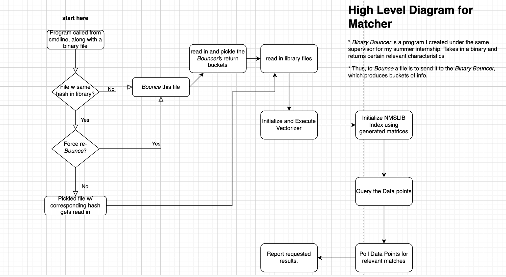

Binary Akinator DESCRIPTION:
This tool is run on an ELF or PE binary and tries to return k-Nearest-Neighbors files among those that have already been ingested into the pickled_files folder:

    INTENDED USE:
        * To be run on single binary file to compare against other files in existing library set
        * Returns k-Nearest-Neighbors (kNN) among library set, or those passing benchmark confidence levels

    RUNNING:
        * Requirements: Existence of /buckets & /model folders within project directory,   (nothing needed in it)
        * '--help' for help

    Library Set:
        * Stored in pickled_files/ sub-directory
        * populated by running akinator on them, to be ingested
        * comprised of previously ingested files

    Data to be matched:
        * Pipes resulting buckets from Binary Bouncer, performs KNN Document Matching based on this data for each binary file in library set
    
    Results:
        * shell output
        * results/ folder stores most recent results for each hash/filename pair
        * TODO: perhaps output the command options that were run resulting in the specified result

    Pickle Validator:
        * helper_files/pickle_validator.py
        * directions on how to validate the generated pickle for recently ingested file are given as part of shell output.

    IMPORTANT NOTES: (updated as necessary)
        

USAGE: 
    
    python3 akinator.py [OPTIONS] INCOMING_BINARY
    or
    1) chmod +x akinator.py  (one time, turning into executable)
    2) --> ./akinator.py [OPTIONS] INCOMING_BINARY

    Options:
    --bounce             set this flag if a previously bounced file needs to get
                        re-bounced
    --n INTEGER          sets the number of nearest neighbors to return, kNN,
                        default 1
    --benchmark INTEGER  return all kNN with a confidence over this benchmark,
                        default: 60
    --help               Show this message and exit.

